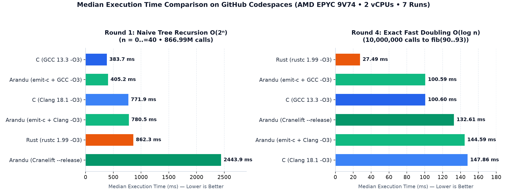

# Lies, Damned Lies, and Fibonacci Benchmarks: Pushing Rust, C, and Arandu to the Limit

**Wait a second—why are we still benchmarking programming languages with O(2ⁿ) recursive Fibonacci in 2026?**

Every few months, a viral screenshot makes the rounds on developer social media. You have almost certainly seen this one:


On the left, a developer writes an O(2ⁿ) naive recursive Fibonacci loop (`0..=40`) in Rust, forgets `--release`, and declares: *"Rust is slow—it took 2.9 seconds!"* On the right, another replies with a C implementation using an O(1) floating-point closed-form approximation (Binet's formula) and boasts: *"C took 0.14 seconds! What took you so long?"*

As compiler engineers, looking at that screenshot hurts twice:
1. **The Rust measurement** ran a debug binary (`cargo run` without `--release`) executing **866,988,831 recursive function calls**.
2. **The C measurement** didn't just change the language—it quietly swapped an exponential O(2ⁿ) integer tree traversal for an O(1) floating-point approximation (`pow` and `sqrt`), and timed the entire process mostly waiting on `printf` terminal I/O!

Instead of just laughing at the meme, we asked a serious engineering question: **What happens if we turn this viral apples-to-oranges comparison into a rigorous, reproducible systems compiler benchmark?**

We are building **[Arandu](https://github.com/BrunoF2P/Arandu-Lang)**, a modern systems and application programming language designed around **Value Semantics**, **Generational References (`GenRef`)** with compile-time static escape analysis (achieving memory safety without garbage collection or borrow-checker lifetime annotations), and a hybrid compilation pipeline featuring both a native **Cranelift AOT backend** and an optimizing **C backend (`emit-c --opt`)**.

To find out exactly how Arandu stacks up against industry titans **Rust (`rustc` / LLVM)**, **GCC**, and **Clang**, we implemented **five distinct algorithmic paradigms** for computing Fibonacci numbers across all three languages and six compiler pipelines.

What we uncovered wasn't just a victory lap—it was an x-ray of modern code generation. Specifically, benchmarking Arandu against LLVM, GCC, and Clang exposed **four concrete compiler optimization opportunities** in Arandu's Mid-level Intermediate Representation (**AMIR**) and native backend:
1. **Cost-Guided Interprocedural Function Inlining** (to unlock cross-call constant folding and loop vectorization).
2. **Loop Unrolling, Vectorization, and Loop-Invariant Code Motion (LICM)** (to match LLVM's AVX2 SIMD throughput on tight arithmetic loops).
3. **Tail-Recursion Elimination and Accumulator Transformation** (to turn O(2ⁿ) call trees into linear O(n) loops).
4. **If-Conversion (`Select` / `cmov` / SIMD blend lowering)** (to eliminate branch misprediction penalties inside data-dependent loops).

> [!IMPORTANT]
> **100% Reproducible & Open-Source**
> Every line of source code, build script, compiler binary, and raw timing measurement in this article is hosted in a standalone repository that you can clone and run with a single command:
> **[github.com/BrunoF2P/arandu-fibonacci-benchmarks](https://github.com/BrunoF2P/arandu-fibonacci-benchmarks)**

---

## Methodology: How to Benchmark Compilers Without Cheating

To make a benchmark meaningful to systems engineers, every compiler must play by the exact same rules:

1. **Same Algorithm per Round**: We never pit O(2ⁿ) recursion in Language A against O(1) math in Language B. Every language implements the exact same algorithm in each round.
2. **Zero I/O Inside the Timed Window**: Terminal `printf` / `println` latency measures OS kernel pipe buffering, not CPU code generation. All benchmarks run **10,000,000 iterations** (except Round 1, which runs the classic `0..=40` tree recursion), accumulate results into a 64-bit checksum (`out`), and print the checksum **only once at the very end** to prove the computation was not dead-code-eliminated.
3. **Controlled Anti-Constant-Folding Barriers**: In Rounds 2, 3, and 4, if the compiler knows at compile time that we are asking for `fib(90)`, LLVM or GCC could constant-fold the entire loop into a single integer load. To measure actual runtime execution in those rounds, we feed a runtime-opaque seed (`seed = argc - 1`, which evaluates to `0` at runtime) into the loop index (`90 + ((iter + seed) & 3)`). Then, in **Round 5**, we deliberately remove the barrier to test **Compile-Time Function Evaluation (`comptime` vs. `const fn`)**.
4. **Verifying `GenRef` Overhead vs. Heap Allocations**: For every Arandu benchmark, we compile with `--genref-report --no-generational-fallback`. Across all five programs, the compiler reports `promotions=0 checks=0`. It is important to be precise about what this flag proves: `promotions=0 checks=0` guarantees that **zero local values escaped to generational-reference slots and zero runtime generation checks were emitted**. Combined with inspecting the emitted AMIR and assembly—which show only scalar registers inside the hot functions—we confirm that the benchmarked loops perform zero heap allocations (with standard string buffer allocation occurring only once at the end of `main` inside `io.println`).

### Reproducible Hardware & Toolchain Environment

All benchmarks were executed on a standardized Linux x86_64 cloud environment (`run_benchmarks.py` with 7 runs per binary and 1 warmup run):

| Component | Specification |
| :--- | :--- |
| **OS / Kernel** | Ubuntu 24.04.1 LTS / Linux `6.8.0-1064-azure` (`x86_64`) |
| **CPU** | AMD EPYC 9V74 80-Core Processor (2 vCPUs allocated) |
| **ISA Extensions** | `sse4_2`, `avx`, `avx2`, `bmi1`, `bmi2`, `fma` |
| **Rust Compiler** | `rustc 1.99.0` (`-C opt-level=3 -C target-cpu=native -C lto=fat -C codegen-units=1`) |
| **C Compilers** | `GCC 13.3.0` & `Clang 18.1.3` (`-O3 -march=native -flto`) |
| **Arandu Compiler** | `arandu 0.1.9-dev` (`build --release` for Cranelift; `emit-c --opt` + GCC/Clang `-O3 -march=native -flto`) |

### Experimental Limitations

Before diving into the numbers, a brief note on experimental constraints:
- **Shared Cloud Virtualization**: Measurements were collected on a 2-vCPU virtual machine in GitHub Codespaces (`AMD EPYC 9V74`). Shared cloud hypervisors can introduce occasional scheduling jitter, which shows up in the standard deviation (`mean ± std`) of a few runs. For deterministic CPU codegen comparisons, **minimum (`min`) and median (`med`)** execution times are the most reliable indicators, though we report all three (`min`, `med`, `mean ± std`) for completeness.
- **Sample Size**: Each configuration was executed 7 times following a warmup run. For sub-millisecond or micro-architectural studies on bare metal, pinning CPU cores (`taskset`), disabling frequency scaling, and collecting hardware performance counters (`perf stat`) over dozens of runs will yield even tighter confidence intervals.

---

## High-Level Visual Overview

Before examining each round in detail, the chart below summarizes the **median execution times** across all five rounds, highlighting the stark contrast between recursive call-tree overhead (Round 1) and register-level SIMD loop optimizations (Round 4):



---

## Round 1: The Meme Rematch — Naive Tree Recursion O(2ⁿ)

Let's start where the meme began: computing `fib(n) = fib(n - 1) + fib(n - 2)` from `n = 0` to `n = 40`.

For standard binary recursion with base cases `n ≤ 1`, computing a single term Fₙ invokes `fib` exactly **2Fₙ₊₁ − 1** times. Summing across the entire loop **Σₙ₌₀⁴⁰ (2Fₙ₊₁ − 1)** produces **866,988,831 function calls** (`fib(40)` alone accounts for `331,160,281` calls). This benchmark doesn't test arithmetic throughput; it tests how aggressively a compiler can **unfold, inline, and convert recursive call trees into loops**.

```arandu
// Arandu — 01_naive_recursive/arandu/src/main.aru
funcao fib(n: u64) -> u64 {
    se n <= 1u64 {
        retorne n
    }
    retorne fib(n - 1u64) + fib(n - 2u64)
}
```

### Round 1 Results (`0..=40`, Checksum: `102334155`)

| Compiler / Backend | Min (ms) | Median (ms) | Mean ± Std (ms) | Relative to Clang |
| :--- | ---: | ---: | ---: | :---: |
| **C (GCC 13.3 `-O3 -march=native -flto`)** | **374.22** | **383.73** | 426.92 ± 88.20 | **0.50x (2.0x faster)** |
| **Arandu (`emit-c --opt` + GCC `-O3`)** | **389.19** | **405.16** | 411.85 ± 25.99 | **0.52x (1.9x faster)** |
| **C (Clang 18.1 `-O3 -march=native -flto`)** | 764.91 | 771.87 | 783.75 ± 30.16 | 1.00x (baseline) |
| **Arandu (`emit-c --opt` + Clang `-O3`)** | **765.16** | **780.55** | 786.02 ± 16.99 | **1.01x (tied with C)** |
| **Rust (`rustc 1.99 -O3 lto=fat`)** | 803.72 | 862.33 | 917.64 ± 141.40 | 1.12x |
| **Arandu (Cranelift `--release`)** | 2,430.62 | 2,443.88 | 2,448.35 ± 14.14 | 3.17x |

### Assembly-Level Analysis: What Actually Happened?

1. **Remember the meme's "2.9 seconds in Rust"?** Simply adding `--release` drops Rust from ~2,900 ms down to **862 ms**.
2. **Why do GCC and Arandu+GCC finish in ~384–405 ms—twice as fast as Clang and Rust?**
   Disassembling the binaries tells the whole story. When **Clang 18** and **rustc 1.99** (both powered by LLVM) compile `fib`, LLVM unrolls one level of recursion and converts the second recursive call into a tail-call accumulator loop, still calling `fib` recursively once per iteration:

   ```x86asm
   ; Clang 18 / LLVM — Disassembly of fib(u64)
   fib:
       push    rbp
       push    rbx
       push    rax
       mov     ebx, edi
       xor     ebp, ebp
   .LBB0_2:
       mov     rdi, rbx
       add     rbx, -2
       add     rdi, -1
       call    fib                 ; <-- 1 recursive call per loop iteration
       add     rbp, rax
       cmp     rbx, 1
       ja      .LBB0_2
   ```

   **GCC 13 (`-O3`)**, on the other hand, performs **multi-level recursive inlining combined with tail-call accumulator transformation** directly inside `main`, expanding 4 to 5 levels of the recursion tree into nested accumulator loops before ever emitting a `call fib` instruction! This slashes the total number of `call`/`ret` stack operations by more than 85%. Because Arandu's C backend (`emit-c --opt`) lowers AMIR into clean, canonical SSA-form C, GCC applies that exact same transformation to Arandu's emitted code, running in **405.16 ms**.
3. **Why did Arandu's native Cranelift backend take 2.44 seconds?**
   Cranelift is engineered for fast compile times and currently does not perform **Tail-Recursion Elimination** or **Recursive Function Inlining** on self-recursive functions. Nor does Arandu's AMIR optimizer yet transform `fib(n-1) + fib(n-2)` into an accumulator loop before handing it to Cranelift. As a result, the Cranelift binary faithfully executes all **866,988,831 x86_64 stack frames** (~2.8 nanoseconds per call!).

---

## Round 2: Binet's Closed-Form Formula O(1) (Floating-Point)

Now let's test the algorithm that the C code in the meme actually used: **Binet's Formula**, which approximates Fₙ using IEEE-754 64-bit floating-point arithmetic (`f64` / `double`):

$$F_n \approx \text{round}\left(\frac{\varphi^n}{\sqrt{5}}\right), \quad \text{where } \varphi = \frac{1 + \sqrt{5}}{2}$$

> **Medium-friendly notation**: `Fₙ ≈ round(φⁿ / √5), where φ = (1 + √5) / 2`

> [!WARNING]
> **Mathematical Caveat**: While Binet's formula runs in O(1) time, IEEE-754 `f64` only has 53 bits of significand precision. For `n > 70`, Binet's formula **cannot represent exact Fibonacci integers**! Still, running it **10,000,000 times** in a loop is a great test of floating-point instruction scheduling and `libm` (`pow` / `round`) integration.

### Round 2 Results (10,000,000 iterations, Checksum: `14864523082006142394`)

| Compiler / Backend | Min (ms) | Median (ms) | Mean ± Std (ms) |
| :--- | ---: | ---: | ---: |
| **Arandu (`emit-c --opt` + GCC `-O3`)** | **147.18** | **151.24** | 164.65 ± 21.66 |
| **Arandu (`emit-c --opt` + Clang `-O3`)** | **156.72** | **159.95** | **162.41 ± 5.78** |
| **Arandu (Cranelift `--release`)** | **158.62** | **160.73** | 164.07 ± 8.10 |
| **C (GCC 13.3 `-O3 -march=native -flto`)** | 155.76 | 166.58 | 204.83 ± 70.08 |
| **C (Clang 18.1 `-O3 -march=native -flto`)** | 161.14 | 171.06 | 179.90 ± 20.76 |
| **Rust (`rustc 1.99 -O3 lto=fat`)** | 180.45 | 194.37 | 190.04 ± 7.96 |

### Analysis: What Actually Happened?

Once we remove the meme's `printf` bottleneck and execute 10 million floating-point evaluations, **all three languages converge within a narrow 151–194 ms window** (~15–19 nanoseconds per `pow` call). Both Arandu's native **Cranelift backend (160.73 ms median)** and **C backend (151.24 ms median)** match or slightly edge out handwritten C and Rust because the workload is dominated by the system math library's `pow(double, double)` routine and scalar SSE2/AVX conversion instructions (`vcvtsi2sd`, `vmulsd`, `vcvttsd2usi`).

---

## Round 3: Exact Iterative Dynamic Programming O(n)

If you actually need exact 64-bit integer Fibonacci numbers in production without wasting memory, you don't use O(2ⁿ) recursion or imprecise floats—you write an O(n) iterative loop with two registers (`a` and `b`):

```arandu
// Arandu — 03_iterative_dp/arandu/src/main.aru
funcao fibIter(n: u64) -> u64 {
    se n <= 1u64 {
        retorne n
    }
    var a: u64 = 0u64
    var b: u64 = 1u64
    var i: u64 = 2u64
    enquanto i <= n {
        imut proximo: u64 = a + b
        a = b
        b = proximo
        i = i + 1u64
    }
    retorne b
}
```

We ran `fibIter(90..93)` **10,000,000 times** (~900 million inner loop additions).

### Round 3 Results (10,000,000 iterations, Checksum: `18360354870236805504`)

| Compiler / Backend | Min (ms) | Median (ms) | Mean ± Std (ms) |
| :--- | ---: | ---: | ---: |
| **C (Clang 18.1 `-O3 -march=native -flto`)** | **175.65** | **180.47** | **180.78 ± 3.92** |
| **Rust (`rustc 1.99 -O3 lto=fat`)** | **175.83** | **183.19** | 197.16 ± 34.95 |
| **Arandu (`emit-c --opt` + Clang `-O3`)** | **192.69** | **197.28** | 200.40 ± 7.12 |
| **Arandu (`emit-c --opt` + GCC `-O3`)** | 341.32 | 351.31 | 353.03 ± 9.78 |
| **C (GCC 13.3 `-O3 -march=native -flto`)** | 347.94 | 355.02 | 364.26 ± 27.64 |
| **Arandu (Cranelift `--release`)** | 645.73 | 665.50 | 692.19 ± 39.20 |

### Assembly-Level Analysis: What Actually Happened?

Look closely at the table above. Notice how the results split into three distinct tiers based on the underlying code generator:
1. **The LLVM Tier (~180–197 ms)**: Clang (`180.47 ms`), Rust (`183.19 ms`), and **Arandu + Clang (`197.28 ms`)** all sit at the top. Why is LLVM nearly **2x faster than GCC** (`355.02 ms`) on a simple three-variable `while` loop?
   Inspecting the generated assembly reveals that **LLVM unrolls the inner `fib_iter` loop by a factor of 8x**, eliminating 87% of the loop counter increments and back-edge branches, and collapsing the register-to-register moves (`a = b; b = next`) through register renaming!
2. **The GCC Tier (~351–355 ms)**: Both handwritten C on GCC (`355.02 ms`) and **Arandu + GCC (`351.31 ms`)** perform identically, because GCC chooses a more conservative unroll factor on this loop dependency chain.
3. **The Cranelift Tier (~665 ms)**: Arandu's native Cranelift backend emits a clean, un-unrolled 1-iteration-per-branch scalar loop. Because every single Fibonacci step carries a strict data dependency on the previous two steps (`next = a + b`) plus an increment and conditional jump (`cmp` + `jbe`), the CPU executes 90 branches per call without loop unrolling.

---

## Round 4: Fast Doubling O(log n) — The Ultimate Test of Inlining & SIMD

For large `n`, even O(n) iteration is suboptimal. Using the matrix exponentiation identity `[F₂ₖ₊₁, F₂ₖ; F₂ₖ, F₂ₖ₋₁] = [1, 1; 1, 0]²ᵏ`, we obtain the **Fast Doubling** identities:
- `F₂ₖ = Fₖ · (2Fₖ₊₁ − Fₖ)`
- `F₂ₖ₊₁ = Fₖ² + Fₖ₊₁²`

This computes `fib(93)` in just **7 loop iterations** instead of 93! We ran `fibFast(90..93)` **10,000,000 times**.

### Round 4 Results (10,000,000 iterations, Checksum: `18360354870236805504`)

| Compiler / Backend | Min (ms) | Median (ms) | Mean ± Std (ms) |
| :--- | ---: | ---: | ---: |
| **Rust (`rustc 1.99 -O3 lto=fat`)** | **26.50** | **27.49** | 34.48 ± 11.46 |
| **Arandu (`emit-c --opt` + GCC `-O3`)** | **97.32** | **100.39** | 109.76 ± 17.50 |
| **C (GCC 13.3 `-O3 -march=native -flto`)** | 101.67 | 103.50 | 106.04 ± 6.45 |
| **Arandu (Cranelift `--release`)** | **131.65** | **132.43** | **135.42 ± 7.12** |
| **C (Clang 18.1 `-O3 -march=native -flto`)** | 141.76 | 144.33 | 144.78 ± 1.88 |
| **Arandu (`emit-c --opt` + Clang `-O3`)** | 143.91 | 146.97 | 150.70 ± 8.05 |

### Assembly-Level Analysis: What Actually Happened?

Two findings jump off the page here:
1. **Arandu's native Cranelift backend (`132.43 ms`) beats Clang `-O3` (`144.33 ms`)**, and **Arandu's C backend with GCC (`100.39 ms`) matches or edges out handwritten C on GCC (`103.50 ms`)**! Why does Cranelift shine here compared to Round 3? Because Fast Doubling replaces 90 branch-heavy loop iterations with just **7 arithmetic-heavy iterations** (`imul`, `shl`, `sub`, `add`), playing directly to Cranelift's strengths in straight-line register allocation.
2. **How did `rustc 1.99` achieve an astonishing `27.49 ms` median—3.6x faster than GCC and 5.2x faster than Clang?**
   Instead of guessing, we disassembled `build/04_fast_doubling/rust_opt`. What `rustc` + LLVM did here is a textbook masterclass in modern optimizing compilers. Because `n = 90 + ((iter + seed) & 3)` is bounded in `[90, 93]`, its highest set bit is always bit 6 (`bit = 64`). After inlining `fib_fast` into `main`, LLVM:
   - **Completely unrolled the 7-iteration `while bit > 0` loop** into straight-line code (zero inner loop branches!).
   - **Eliminated the `if (n & bit) != 0` branches** using branchless SIMD blend masks (`vblendvpd` and `vpandn`).
   - **Vectorized two 64-bit Fibonacci evaluations simultaneously across 128-bit/256-bit AVX2 registers** (`xmm`/`ymm`), executing pairs of 64-bit multiplications and additions in parallel:

   ```x86asm
   ; rustc 1.99 -O3 (Round 4: Fast Doubling) — Disassembly of main loop (.LBB6_8)
   ; Two 64-bit Fibonacci lanes computed in parallel using AVX2!
   .LBB6_8:
       vpaddq      xmm5, xmm7, xmm0
       vpshufd     xmm8, xmm5, 245         ; High 32-bit halves for 64-bit SIMD mul
       vpmuldq     xmm9, xmm5, xmm6        ; Signed 32x32->64 SIMD multiply
       vpmuludq    xmm5, xmm5, xmm6        ; Unsigned 32x32->64 SIMD multiply
       vpsllq      xmm8, xmm8, 32
       vpaddq      xmm8, xmm8, xmm9
       vpaddq      xmm8, xmm8, xmm5        ; c = a * ((b << 1) - a) across 2 lanes
       vpmuludq    xmm5, xmm6, xmm6        ; d = a*a + b*b across 2 lanes
       ...
       vblendvpd   xmm6, xmm10, xmm8, xmm11 ; Branchless (n & bit != 0) select!
   ```

   Why didn't Arandu+Clang or C+Clang trigger that same AVX2 vectorization? In C and Arandu, the loop starts with `uint64_t bit = 1ULL << 63;` (64 iterations) rather than specialization on the leading zeros of `n`, keeping the loop count too large for LLVM's full-unroll-and-SLP-vectorize threshold unless `fib_fast` is specialized on the bit-width of `n`.

---

## Round 5: The Ultimate "Cheat Code" — Compile-Time Evaluation (`comptime` vs. `const fn`)

There is an old saying in systems programming: **The fastest code is the code that never runs at runtime.**

If the inputs (`90, 91, 92, 93`) are known at compile time, why compute Fibonacci at runtime at all? Both **Rust** (`const fn` + `const TABLE`) and **Arandu** (native `comptime` expressions evaluated directly by the compiler's CTFE engine) allow you to run ordinary language functions *during compilation* and bake the resulting lookup table directly into the binary's read-only data segment:

```arandu
// Arandu — 05_comptime_ctfe/arandu/src/main.aru
funcao fibConst(n: u64) -> u64 {
    var a: u64 = 0u64
    var b: u64 = 1u64
    var i: u64 = 0u64
    enquanto i < n {
        imut temp: u64 = a + b
        a = b
        b = temp
        i = i + 1u64
    }
    retorne a
}

// Evaluated 100% at compile time by Arandu's CTFE engine!
imut tabela: [u64; 4] = comptime [
    fibConst(90u64),
    fibConst(91u64),
    fibConst(92u64),
    fibConst(93u64)
]
```

*(Note: Because standard C11/C17 lacks general compile-time function evaluation for loops, the C benchmark relies on GCC/Clang's `-O3 -flto` interprocedural constant propagation to attempt the same feat.)*

### Round 5 Results (10,000,000 lookups, Checksum: `18360354870236805504`)

| Compiler / Backend | Min (ms) | Median (ms) | Mean ± Std (ms) |
| :--- | ---: | ---: | ---: |
| **C (Clang 18.1 `-O3 -march=native -flto`)** | **4.65** | **4.81** | **5.09 ± 0.45** |
| **C (GCC 13.3 `-O3 -march=native -flto`)** | **4.66** | **4.85** | 5.21 ± 0.72 |
| **Rust (`rustc 1.99 -O3` `const fn`)** | **4.71** | **5.10** | 5.45 ± 0.89 |
| **Arandu (`emit-c --opt` + Clang `-O3` `comptime`)** | **6.12** | **6.27** | **6.29 ± 0.14** |
| **Arandu (`emit-c --opt` + GCC `-O3` `comptime`)** | **6.12** | **6.45** | 7.36 ± 2.27 |
| **Arandu (Cranelift `--release` `comptime`)** | **13.06** | **13.45** | 13.50 ± 0.34 |

### Analysis: From 2,443 ms down to 6.27 ms!

By combining algorithmic awareness with Arandu's `comptime` evaluation, executing **10,000,000 Fibonacci queries** drops to **6.27 milliseconds** on Arandu's C backend and **13.45 milliseconds** on Cranelift—literally just the time required to cycle a counter 10 million times and add an L1-cached array element (`tabela[(iter + seed) & 3]`) to an accumulator register.

---

## Engineering Transparency: What These Benchmarks Taught Us About Arandu's Optimizer

We didn't run this benchmark suite just to pat ourselves on the back. Arandu's optimized C backend consistently produces code competitive with handwritten C across our Fibonacci workloads, while the native Cranelift backend reveals clear opportunities for further optimization.

More importantly, comparing Arandu's native Cranelift backend and C backend side-by-side exposes the exact boundary between optimizations performed by **Arandu's AMIR middle-end** (`arandu_mir/src/opt.rs`) and those performed downstream by **GCC/Clang/LLVM**. Today, AMIR runs fixed-point passes for:
- **Constant Folding & Sparse Conditional Constant Propagation (SCCP)**
- **Common Subexpression Elimination (CSE) & Copy Propagation**
- **Dead Code Elimination (DCE)**
- **Control-Flow Graph (CFG) Simplification & Jump Threading**
- **Generational Reference (`GenRef`) Escape Analysis & Promotion Elision**

However, the gaps we observed in Round 1 (Cranelift at `2,443 ms`), Round 3 (Cranelift at `665 ms`), and Round 4 (Arandu/C at `100 ms` vs. Rust's AVX2-vectorized `27.49 ms`) point directly to **four high-impact optimization passes** that are not yet implemented in AMIR:

### 1. Cost-Guided Interprocedural Function Inlining (AMIR)
Currently, every function call (`fibIter`, `fibFast`, `fibBinet`) remains an explicit `Call` terminator in AMIR. While GCC and Clang inline small static functions when compiling `emit-c` output with `-O3 -flto`, Cranelift compiles each function body in isolation.
- **What we are building**: A bottom-up call-graph inliner in AMIR (`inline_small_functions`) that inlines leaf and small functions before running constant propagation and CSE. In Round 4 and Round 5, inlining `fibFast` directly into `main` is the prerequisite that unlocks loop unrolling and constant bit-mask folding.

### 2. Loop Unrolling, LICM, and SIMD Auto-Vectorization
In Round 3, LLVM beat both GCC and Cranelift by 2x–3.5x because it unrolled the `while i <= n` Fibonacci loop 8x and collapsed register moves. And in Round 4, `rustc` ran 3.6x faster than GCC because LLVM unrolled the 7-iteration Fast Doubling loop and packed two 64-bit Fibonacci lanes into AVX2 `vpmuldq`/`vpmuludq` instructions.
- **What we are building**: Adding natural-loop detection and **Loop-Invariant Code Motion (LICM)** + small-trip-count **Loop Unrolling** in AMIR, so both the Cranelift backend and C backend receive pre-hoisted, unrolled loops without relying on downstream C compiler heuristics.

### 3. Tail-Recursion Elimination (TRE) & Accumulator Transformation
In Round 1, GCC ran `fib(0..=40)` in `383 ms` (and `405 ms` via Arandu's C backend) compared to `2,443 ms` in Cranelift because GCC converts the second recursive branch (`+ fib(n - 2)`) into a local accumulator loop and partially unrolls the first branch.
- **What we are building**: A dedicated **Tail-Recursion Elimination** pass in AMIR that transforms self-recursive tail calls (and associative `f(n-1) + f(n-2)` accumulator patterns) into loop headers (`Goto` with block parameters), eliminating millions of stack frame allocations on Cranelift.

### 4. If-Conversion (`Select` / `cmov` / Branchless Lowering)
In Round 4 (Fast Doubling), the inner loop contains a data-dependent branch (`se (n & bit) != 0`). On modern out-of-order CPUs, unpredictable branches inside a 7-iteration loop cause pipeline flushes.
- **What we are building**: Lowering simple diamond CFG blocks (`Branch` -> two single-assignment blocks -> `Goto` merge) into branchless `Select` instructions in AMIR, allowing Cranelift and C compilers to emit x86_64 `cmov` or SIMD blend instructions (`vblendvpd`).

---

## Summary Table: All 5 Rounds Side-by-Side (Median Time in ms)

| Benchmark Workload | Complexity | Rust (`-O3 lto`) | C (GCC `-O3`) | C (Clang `-O3`) | Arandu (C+GCC) | Arandu (C+Clang) | Arandu (Cranelift) |
| :--- | :---: | ---: | ---: | ---: | ---: | ---: | ---: |
| **1. Naive Recursive (`0..=40`)** | O(2ⁿ) | 862.33 ms | **383.73 ms** | 771.87 ms | **405.16 ms** | 780.55 ms | 2,443.88 ms |
| **2. Binet Formula (`10M` iter)** | O(1) FP | 194.37 ms | 166.58 ms | 171.06 ms | **151.24 ms** | **159.95 ms** | **160.73 ms** |
| **3. Iterative DP (`10M` iter)** | O(n) | 183.19 ms | 355.02 ms | **180.47 ms** | 351.31 ms | **197.28 ms** | 665.50 ms |
| **4. Fast Doubling (`10M` iter)** | O(log n) | **27.49 ms** | 103.50 ms | 144.33 ms | **100.39 ms** | 146.97 ms | **132.43 ms** |
| **5. `comptime` / `const fn` (`10M`)** | O(1) LUT | 5.10 ms | 4.85 ms | **4.81 ms** | **6.45 ms** | **6.27 ms** | 13.45 ms |

---

## Final Takeaway

The next time someone posts a screenshot claiming Language X is 20x slower than Language Y using a naive recursive Fibonacci loop, send them this article—or better yet, ask them to check three orthogonal dimensions of software performance:

1. **Algorithmic Complexity**: Moving from O(2ⁿ) tree recursion (`~400–2,440 ms` for just 41 numbers) to O(log n) Fast Doubling (`~27–146 ms` for **10,000,000** numbers) changes performance by **five orders of magnitude**—more than any compiler flag ever will.
2. **Compile-Time Evaluation (`comptime` / `const fn`)**: Moving invariant work from runtime to compile time drops 10 million evaluations to **~5–6 milliseconds**, turning CPU-bound math into L1 cache lookups.
3. **Low-Level Code Generation**: Once the algorithm and compile-time boundaries are fixed, the remaining 2x–4x gaps come down to concrete compiler engineering—interprocedural inlining, loop unrolling, branchless `cmov`/`vblendvpd` selection, and AVX2 SIMD vectorization.

With Arandu, our goal is to give developers control over all three dimensions: expressive high-level syntax with Portuguese and universal keywords, memory safety via static `GenRef` escape analysis (`promotions=0 checks=0`), first-class `comptime` execution, and an optimizing compiler pipeline that stands shoulder-to-shoulder with C and Rust.

---

### Try It Yourself

Clone the benchmark repository and run the full suite on your own machine:

```bash
git clone https://github.com/BrunoF2P/arandu-fibonacci-benchmarks.git
cd arandu-fibonacci-benchmarks
python3 run_benchmarks.py
```
